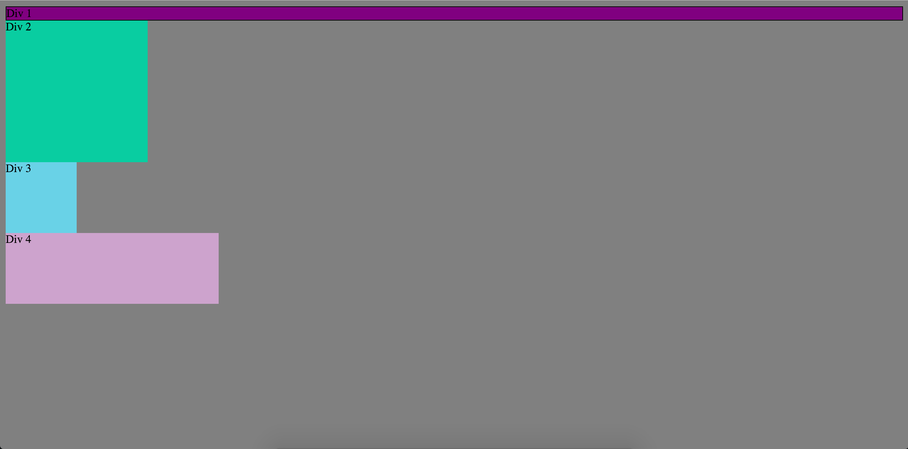
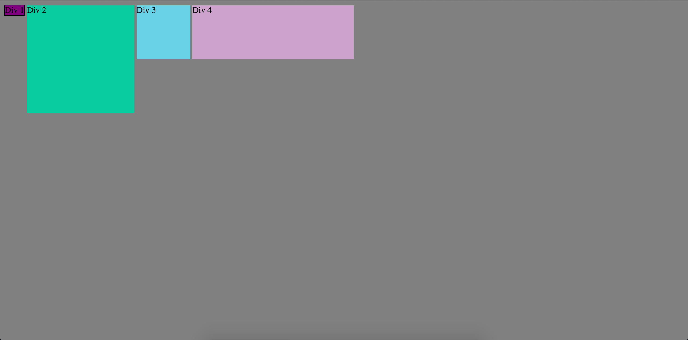
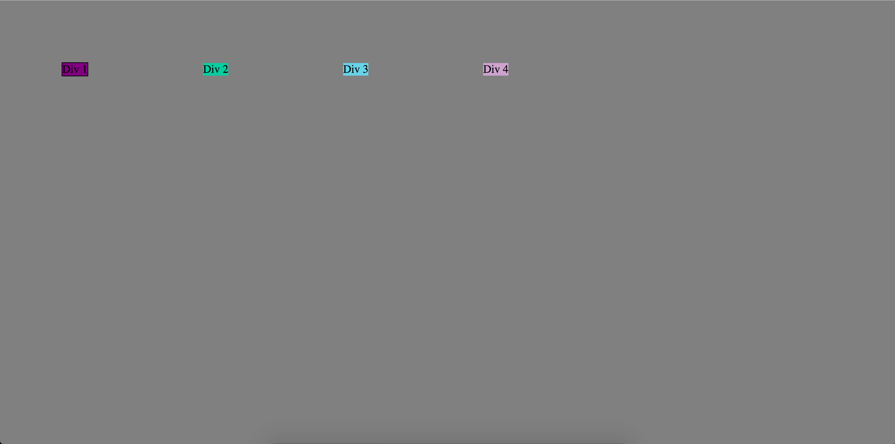
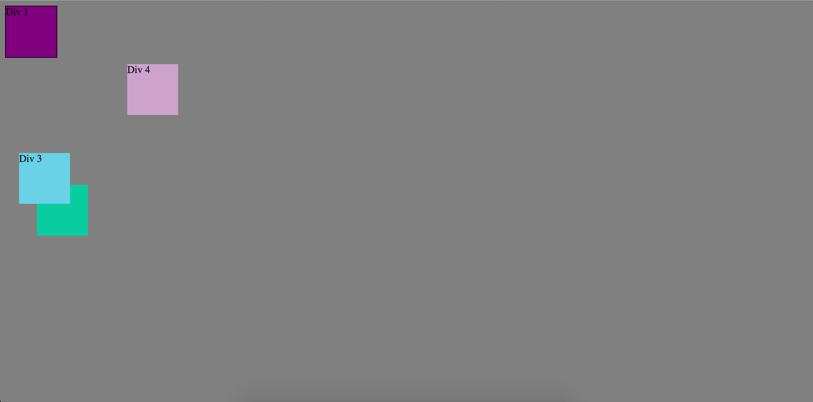
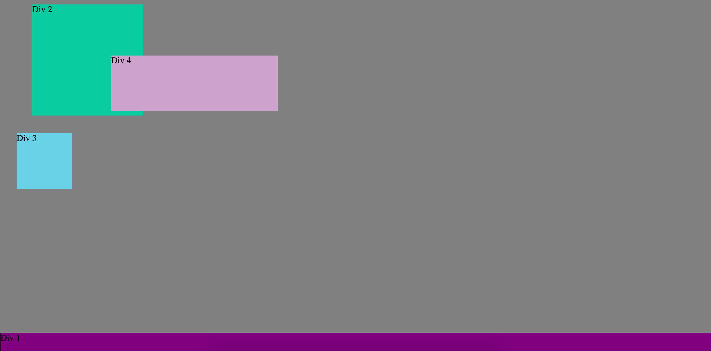
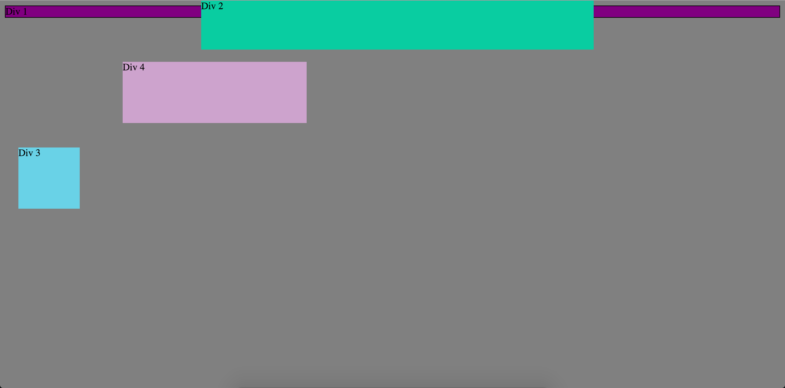
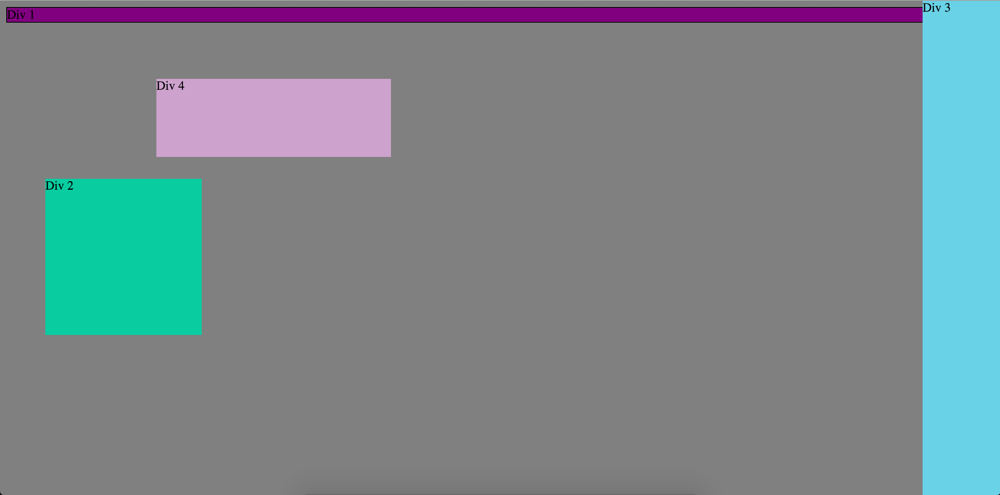
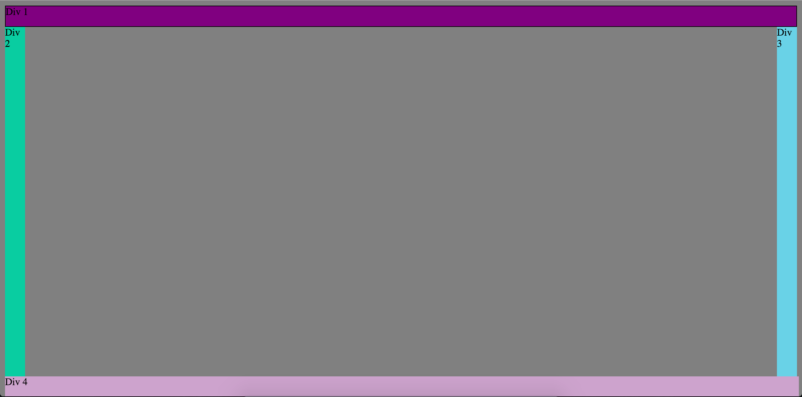

**How can you use Chrome's DevTools inspector to help you format or position elements?**

I think the nice part about the Chrome DevTools inspector is that it allows the user to easily diagnose potential positioning issues visually, which of course is a lot better than doing so in just lines of code. 

I think in particular, seeing the box model, with margins, padding, etc. makes the job way easier. Great tool.

**How can you resize elements on the DOM using CSS?**

A few ways that I think we used:
	-Using actual height / width properties
	-Manipulating parts of the box model -- padding and borders both affect element size

**What are the differences between absolute, fixed, static, and relative positioning? Which did you find easiest to use? Which was most difficult?**

Static:  Default / not positioned - so it renders where it was supposed to
Relative:  Same as static, but with adjustments like top/bottom/left/right that modify its position "relative" to where it otherwise would be
Fixed:  Stays on the page no matter what scrolling happens, positioned relative to the browser window
Absolute:  Positioned relative to its first positioned (not static) ancestor -- I believe this can be to a sibling or to a parent

I think relative and absolute are the most difficult, especially as they could depend on each other so much. I struggled with the absolute a lot, not realizing that it was so dependent on other ancestors.

**What are the differences between margin, border, and padding?**

The way I see it is:
	Margin:  Space around the object, kind of like a moat around the element
	Border: The actual edge, which can be as thick as it wants and adds to the size
	Padding:  The space inside the element from the border, which can also add to size

**What was your impression of this challenge overall? (love, hate, and why?)**

I like this one. I think it forces us to:
1) Learn how to use ChromeDevTools, which looks like it will be useful for working with positioning
2) Think about how to use the various positioning / sizing elements, which will be important as we start building out our own layouts. 