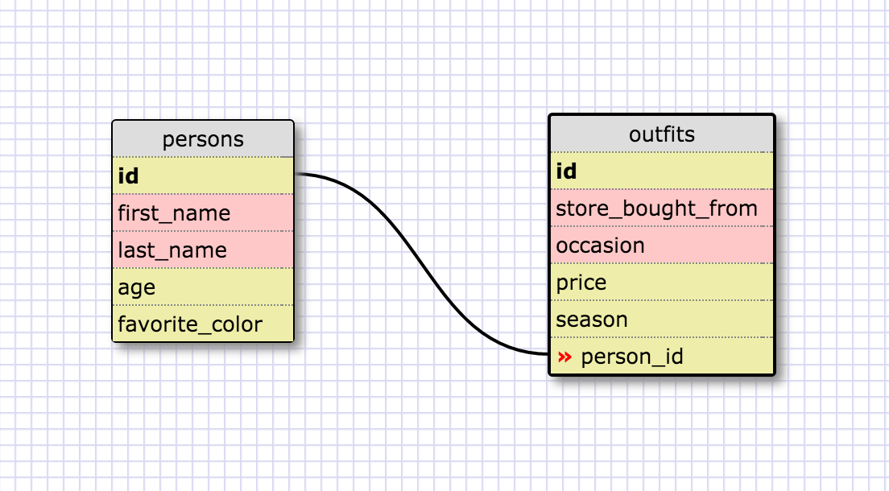

* Select all data for all states

	``
	SELECT *      
	FROM states    
	;
	``

* Select all data for all regions

	``
	SELECT *    
	FROM regions    
	;  
	``

* Select state name and population for all states

	``
	SELECT state_name, population
	FROM states
	;
	``

* Select state name and population for all states ordered by population descending

	``
	SELECT state_name, population
	FROM states
	ORDER BY population DESC
	;
	``

* Select the state name for the states in region 7

	``
	SELECT state_name 
	FROM states 
	WHERE region_id = 7
	;
	``

* Select the state name and population density for all states with density > 50 ordered from least to most dense

	``
	SELECT state_name, population_density  
	FROM states 
	WHERE population_density > 50 
	ORDER BY population_density
	;
	``

* Select state names with population between 1M and 1.5M

	``
	SELECT state_name 
	FROM states 
	WHERE population BETWEEN 1000000 AND 1500000
	``

* Select state name and region ID for states ordered by region in ascending order

	``
	SELECT state_name, region_id
	FROM states
	ORDER BY region_id
	;
	``

* Select regions where the name contains central

	``
	SELECT region_name 
	FROM regions 
	WHERE lower(region_name) LIKE '%central%'
	;
	``

* Select the region name and state name for all states in ascending order by region_id

	``
	SELECT r.region_name, s.state_name 
	FROM states s 
		INNER JOIN regions r 
			ON r.id = s.region_id 
	ORDER BY region_id
	;
	``

* My database

* Reflection

**What are databases for?**

Databases are used to store a lot of data that is generally relational. They are used as a more efficient means of handling alot of data that would be too big for a hash or array.

**What is a one-to-many relationship?**

Where one thing has many components, so we create two tables for this. e.g. For example, if we have a presidential candidates table and a party table, we could say that one party has many candidates.

**What is a primary key? What is a foreign key? How can you determine which is which?**

Primary key in the party table would be the id of each row. The foreign key would be in the candidates table, where we have the id of the party listed in the candidates table so that we can link them.

**How can you select information out of a SQL database? What are some general guidelines for that?**

We use the SELECT statement to pick the columns we want and then the FROM statement to denote what table we want the data from.