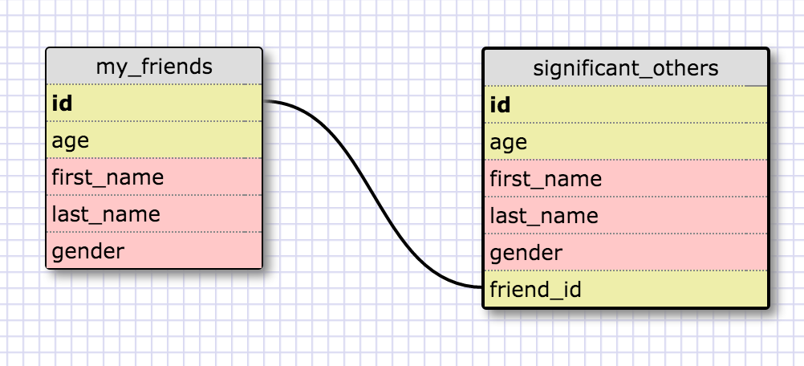
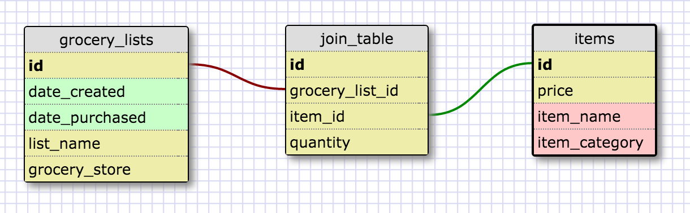

### Release 2: 1-1 Schema
This schema makes sense for a 1-1 relationship, since we will assume monogamy (each friend can only have one significant other) and we assume that not all my friends have a significant other, so there could be NULL SO's haha...

### Release 4: Many-Many Grocery Schema
In this case, we could have many lists for different dates. Each date has many items, so they are listed in a separate table of potential items. Each list and item relationship has a different quantity needed (e.g. maybe we need 4x as many potatoes for the Thanksgiving list), which is why quantity sits in the join table.

### Release 6:  Reflection

**What is a one-to-one database?**  

A 1-1 database contains two tables where the relationships are always one item from one table corresponding to exactly at most one item in the other table.

**When would you use a one-to-one database? (Think generally, not in terms of the example you created).**  

We'd use this when creating a relationship that may not have every instance of one table filled.

**What is a many-to-many database?**  

Many to many database are really 3 tables, where there is a join table in the middle that describes the relationships between the two other tables. 

**When would you use a many-to-many database? (Think generally, not in terms of the example you created).**  

We'd use this in the scenario where the items in the two "outer" tables could correspond (in both ways) to many items in the other table.

**What is confusing about database schemas? What makes sense?**  

Not a ton is confusing here. I've spent considerable time doing SQL database, both querying and creating them, so I'm pretty familiar with the basics at least!
